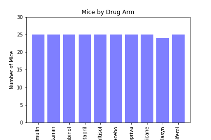
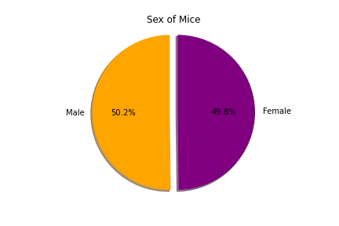
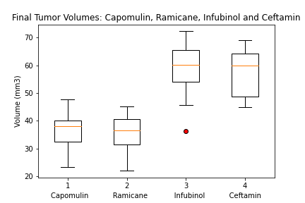
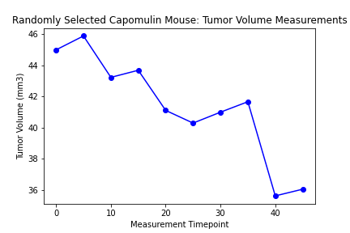
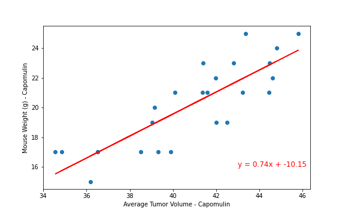

# Matplotlib-challenge

Audience:

The following executive report summarises the high level results from the Pymaceutical's SCC_Mouse phase one study.  

Background:

The purpose of this study was to compare the performance of Pymaceuticals' drug of interest, Capomulin, versus other drug regimens in the search for an effective treatement of squamous cell carcinoma (SCC), the most serious of the commonly occurring non-melenoma skin cancers. 

Hypothesis:

As the design of the study ensured that all mice, despite varying weights, started with the same tumor volume measures on day 0, it was predicted that if Capomulin dose impacts its effectiveness, a relationship between average tumor and mouse starting weight will be apparent. That is, that if the doseage is more effective on lower weight mice than heavier mice, a strong positive relationship between average tumor volume (below starting volume) and mouse weight will be demonstrated and this will indicate that doseage efficacy is impacted by mouse weight. 

Method:

The study included 249 mice identified with SCC tumor growth; all were chosen with the same starting tumor volume of 45mm.   
The mice were split randomly into 10 treatement arms, 9 drugs and 1 placebo. 
The mice were measured once at day 0 of the study.
All mice recieved the same dose of the drug within the treatment arm.
The study took place over the course of 45 days, with tumor development observed and measured every 5 days. 

Analysis:

Data was cleaned and analysed in Python.  Duplicate data was removed for all mice where duplicate measures were taken; 1 mouse data set removed, leaving 248 mice in the analysis.
Basic inferential statistics, Mean, Median, SD, Var and Std Error were performed on all treatment arms and the placebo. 

Capomulin and 3 of the top performing treatments (Ramicane, Infubinol and Ceftamin), were compared using quartile plots. Outliers were determined and indicated on relevant treatment arm plots, no outliers were deemed astronomical or removed.  

Capomulin was futher analysed to determine level of overall efficacy by plotting the treatment trajectory for a randomly selected mouse.

A linear regression (Pearsons r) of mouse weight and average tumor volume was then performed to determine the strenght of realtionship between weight of mouse and mean tumor volumes measured to support analysis of dose efficacy. 

Results:

Inferential Statistics for all drug treatment arms

Comparison of Capomulin against 3 of the other best performing drugs (Ramicane, Infubinol and Ceftamin) 

Randomly selected Capomulin treatement mouse, tumor volume trajectory over treatment days

Linear Regression of Mouse Weight and Average Tumor Volume for Capomulin treatment arm

Discussion:

Capomulin was found to reduce tumor volume growth as demonstrated by low measures of central tendancy and variance.  This is clearly demonstrated in the random mouse treatment trajectory plotted, with a clear downward trend in tumor size plotted across the lenght of the study.  

The linear regression demonstrated a stong positive relationship between mouse weight, taken at the commencement of the study, and average tumor volume (reduced from starting volume) within the Capomulin treated mice; Pearsons r value of 0.84 and r squared of 0.71. Indicating that dose given showed more accelerated shrinkage of tumor volume in smaller mice than heavier mice. 

Ramicane was another front-runner drug, with comparable inferential results to Capomulin, the remaining drugs however, did not demonstrate as high treatment efficacy as Capomulin.  

Recommendations:

The results support a recommendation that Capomulin progress to the next phase of clinical trials, that titration of dose by mouse weight be factored into consequent studies and that Ramicane should also be considered for further trials, as it demonstrated similar treatment efficacy.

